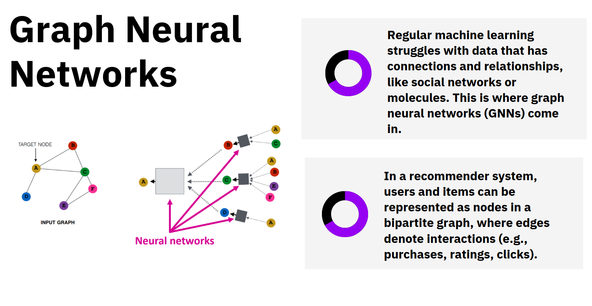

# Introduction

This project is an advanced e-commerce recommendation system that uses a Graph Neural Network (GNN) to provide personalized shopping suggestions based on user preferences and product attributes. By representing users and products as nodes in a graph and leveraging the power of GNNs, this system captures complex relationships between users and products, enabling more accurate and relevant recommendations.

# Objectives
+ Develop a recommendation engine capable of providing real-time suggestions based
on user interactions and changes in preferences.
+ Implement semantic search capabilities to comprehend user queries beyond simple
keyword matching.

# Methodology
## Recommender Engine`

## Search Engine`

# Results

